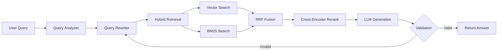

# 🤖 Celeby Agentic RAG 🤖

<div align="center">


**Production-ready Agentic RAG system with LangGraph orchestration, self-correction, hybrid search, and intelligent re-ranking**

[](https://www.python.org/downloads/)
[](https://fastapi.tiangolo.com/)
[](https://react.dev/)
[](https://www.docker.com/)
[](LICENSE)

</div>

---

## 📋 Table of Contents

- [Overview](#-overview)
- [Features](#-features)
- [Architecture](#-architecture)
- [Screenshots](#-screenshots)
- [Quick Start](#-quick-start)
- [Configuration](#-configuration)
- [API Documentation](#-api-documentation)
- [Evaluation](#-evaluation)
- [Project Structure](#-project-structure)
- [Advanced Usage](#-advanced-usage)
- [Troubleshooting](#-troubleshooting)
- [Contributing](#-contributing)
- [License](#-license)

---

## 🌟 Overview

**Celeby Agentic RAG** is an enterprise-grade Retrieval-Augmented Generation system powered by **LangGraph** agent orchestration. Unlike traditional RAG implementations, this system acts as an intelligent agent that validates its own outputs, rewrites queries strategically, and self-corrects when needed—ensuring high-quality, grounded responses every time.

### What Makes This "Agentic"?

This isn't just RAG—it's an **autonomous agent** that:
- 🧠 **Thinks Before Answering**: Analyzes query complexity and chooses optimal strategies
- 🔄 **Self-Validates**: Checks if generated answers are supported by retrieved context
- 🔁 **Auto-Corrects**: Retries with improved retrieval when initial answers fall short
- 🎯 **Multi-Strategy Search**: Combines vector, keyword, and re-ranking intelligently
- 📊 **Self-Monitors**: Tracks its own performance and learns from feedback

### Why Celeby Agentic RAG?

| Problem | Traditional RAG | Celeby Agentic RAG |
|---------|----------------|-------------------|
| **Hallucinations** | No validation, accepts any output | ✅ Validates every answer, retries if unsupported |
| **Poor Retrieval** | Single strategy, hope for best | ✅ Hybrid search + query rewriting |
| **No Quality Metrics** | Blind to accuracy | ✅ Built-in RAGAS evaluation |
| **Slow Responses** | No optimization | ✅ Redis caching + streaming |
| **Black Box** | No visibility | ✅ Full observability dashboard |

### Key Differentiators

- ✅ **LangGraph StateGraph**: Sophisticated agent workflow with decision trees
- 🔄 **Self-Correction Loop**: Automatic retry mechanism with validation gates
- 🔍 **Hybrid Retrieval**: Vector (semantic) + BM25 (keyword) + RRF fusion
- 🎯 **Cross-Encoder Re-ranking**: State-of-the-art precision for top results
- ⚡ **Multiple Response Modes**: Quality (accurate), Fast (streaming), Direct (no-RAG)
- 📊 **Production Monitoring**: Real-time metrics, feedback tracking, RAGAS evaluation
- 🎨 **Modern UX**: React 18 interface with chat history and document management
- 🐳 **One-Command Deploy**: Docker Compose with GPU support (NVIDIA/AMD)

---

## 🔒 Privacy-First & Offline-Capable

### Why Local Deployment Matters

**Celeby Agentic RAG is designed for privacy-conscious users and organizations:**

🔐 **Your Data Never Leaves Your Machine**:
- All documents stay on your local storage
- No external API calls for embeddings or LLM inference
- Vector database (ChromaDB) is stored locally
- Chat history saved in local SQLite databases

🌐 **100% Offline Operation**:
- Once models are downloaded, **no internet required**
- Phi-3 Mini runs entirely on your hardware (CPU/GPU)
- Sentence transformers work offline
- Redis cache is local

📡 **Future-Proof Architecture**:
- Currently: Fully offline and private
- Optional: Web search can be added as a plugin (coming soon)
- Your choice: Keep it local or enable internet features

### Comparison: Cloud vs. Local RAG

| Feature | Cloud RAG Services | Celeby Agentic RAG |
|---------|-------------------|-------------------|
| **Data Privacy** | ❌ Sent to external servers | ✅ Stays on your machine |
| **Internet Required** | ✅ Always | ❌ No (after model download) |
| **Recurring Costs** | ❌ Per-query pricing | ✅ Free after setup |
| **Data Control** | ❌ Provider owns access | ✅ You own everything |
| **Compliance** | ⚠️ Depends on provider | ✅ GDPR/HIPAA friendly |
| **Latency** | ⚠️ Network dependent | ✅ LAN-speed responses |
| **Vendor Lock-in** | ❌ Yes | ✅ Fully portable |

### Perfect For:

- 🏥 **Healthcare**: HIPAA-compliant patient data analysis
- ⚖️ **Legal**: Confidential case document review
- 🏦 **Finance**: Sensitive financial document processing
- 🔬 **Research**: Proprietary research paper analysis
- 🏢 **Enterprise**: Internal knowledge base without data leakage
- 🌍 **Offline Environments**: Air-gapped systems, remote locations

---

## 🌟 Features

### Core Capabilities

| Feature | Description |
|---------|-------------|
| **🔄 Self-Correction** | LangGraph-powered validation and automatic retry mechanism |
| **📝 Query Rewriting** | Generates multiple query variations for comprehensive retrieval |
| **🔍 Hybrid Search** | Combines semantic (vector) + keyword (BM25) with RRF fusion |
| **🎯 Cross-Encoder Re-ranking** | State-of-the-art re-ranking for top-K results |
| **⚡ Streaming Responses** | Real-time ChatGPT-style answer generation |
| **📊 RAGAS Evaluation** | Automated quality metrics (faithfulness, relevancy, recall) |
| **💾 Redis Caching** | Intelligent caching for sub-second response times |
| **📈 Comprehensive Metrics** | Real-time performance monitoring dashboard |
| **👥 User Feedback** | Built-in like/dislike system for continuous improvement |
| **🗂️ Chat History** | Persistent conversation management with SQLite |

### Technical Stack

**Backend (All Local)**:
- **LLM**: Phi-3 Mini (3.8B) via Ollama - Runs on your hardware
- **Framework**: LangGraph for agent orchestration
- **Vector DB**: ChromaDB with local persistent storage
- **Embeddings**: sentence-transformers/all-MiniLM-L6-v2 (offline)
- **Re-ranker**: cross-encoder/ms-marco-MiniLM-L-6-v2 (offline)
- **Keyword Search**: BM25 with Reciprocal Rank Fusion
- **Cache**: Redis for query caching (local, in-memory)
- **API**: FastAPI with async/await support

**Frontend (Local Web App)**:
- **Framework**: React 18 + Vite
- **Styling**: Modern CSS with gradient design
- **State Management**: React hooks
- **HTTP Client**: Axios with streaming support

**Infrastructure (Containerized)**:
- **Containerization**: Docker Compose with GPU support
- **Database**: SQLite for metrics, history & feedback (local files)
- **Logging**: Structured logging with rotation (local files)
- **Network**: Localhost only - no external connections needed

---

## 🏗️ Architecture

```
┌─────────────┐
│   User      │
│  Interface  │
└──────┬──────┘
       │
       ▼
┌─────────────────────────────────────────┐
│         FastAPI Backend                 │
│  ┌────────────────────────────────┐    │
│  │     LangGraph RAG Agent        │    │
│  │  ┌──────────────────────────┐  │    │
│  │  │  1. Query Analysis       │  │    │
│  │  │  2. Query Rewriting (3x) │  │    │
│  │  │  3. Hybrid Retrieval     │  │    │
│  │  │     - Vector Search      │  │    │
│  │  │     - BM25 Search        │  │    │
│  │  │  4. RRF Fusion           │  │    │
│  │  │  5. Cross-Encoder Rerank │  │    │
│  │  │  6. LLM Generation       │  │    │
│  │  │  7. Answer Validation    │  │    │
│  │  │  8. Self-Correction ↻    │  │    │
│  │  └──────────────────────────┘  │    │
│  └────────────────────────────────┘    │
│                                         │
│  ┌─────────┐  ┌─────────┐  ┌────────┐ │
│  │ ChromaDB│  │  Redis  │  │ SQLite │ │
│  └─────────┘  └─────────┘  └────────┘ │
└─────────────────────────────────────────┘
```

### RAG Pipeline Flow



---

## 📸 Screenshots

### 🎯 Main Chat Interface


**Key Features Shown:**
- **Response Modes Dropdown**: Choose between Quality (self-correcting), Fast (streaming), or Direct LLM
- **Chat Sidebar**: Full conversation history with timestamps and message previews
- **Document Panel**: View all uploaded PDFs with chunk counts
- **Real-time Streaming**: ChatGPT-style token-by-token generation
- **Session Management**: Create new chats, switch between conversations
- **Source Citations**: Every answer shows which documents were used

*The interface demonstrates the "Quality - self correcting" mode answering a Harry Potter question with multi-query rewriting, validation, and self-correction for maximum accuracy.*

---

### 📊 System Performance Metrics


**Real-time Monitoring Dashboard:**
- **Total Queries**: 45 questions processed
- **Self-Corrections**: 5 answers automatically improved (11.1% correction rate)
- **Average Latency**: 10.8 seconds per query
- **P95/P99 Latency**: 29.4s / 78.3s for 95th/99th percentile
- **Cache Hit Rate**: 26.7% of queries served from Redis cache
- **Error Rate**: 0.0% - rock-solid reliability
- **Uptime Tracking**: System health monitoring

*This dashboard gives you complete visibility into RAG system performance, helping identify bottlenecks and optimization opportunities.*

---

### 👥 User Feedback System


**Quality Assurance Features:**
- **Like/Dislike Buttons**: User ratings on every answer
- **Satisfaction Metrics**: 75% user satisfaction rate
- **Feedback Analytics**: 3 likes vs 1 dislike tracked
- **Continuous Improvement**: Data-driven quality optimization
- **Reset Capability**: Clean slate for new evaluation periods

*Built-in feedback loop enables you to track answer quality from the user's perspective and identify areas for improvement.*

---

### 🎓 RAGAS Evaluation Results


**Automated Quality Assessment:**
- **Faithfulness: 50.0%** - Answers grounded in retrieved sources
- **Relevancy: 83.3%** - Answers directly address the questions asked
- **Recall: 50.0%** - System retrieved the right documents to answer
- **Test Cases**: 3 synthetic questions generated and evaluated
- **Expandable Details**: View all test questions and ground truth
- **Actionable Insights**: Clear guidance on improving low scores

*RAGAS provides quantitative metrics to measure RAG quality, moving beyond subjective assessment to data-driven optimization.*

---

## 🚀 Quick Start

### Prerequisites

- **Docker & Docker Compose** (20.10+)
- **8GB+ RAM** recommended (16GB for optimal performance)
- **~10GB disk space** for models and data
- **NVIDIA GPU** (optional, for faster inference)
- **Internet connection** (ONLY for initial setup - download models)

### 🌐 Internet Requirements

**Initial Setup (One-Time)**:
- ✅ Download Phi-3 Mini model (~2.3GB)
- ✅ Pull Docker images
- ✅ Download Python dependencies

**After Setup (Normal Operation)**:
- ❌ **No internet required!**
- ✅ 100% offline operation
- ✅ All processing happens locally
- ✅ Perfect for air-gapped environments

**Optional Internet Features (Coming Soon)**:
- 🔄 Web search plugin for real-time information
- 🔄 Model updates
- 🔄 Cloud backup/sync (if desired)

### Installation

#### 1. Clone the Repository

```bash
git clone https://github.com/merenceleby/celeby-agentic-rag.git
cd celeby-agentic-rag
```

#### 2. Start Services

**For CPU-only systems:**
```bash
docker-compose --profile cpu up -d
```

**For NVIDIA GPU systems (Tested on NVIDIA RTX GPUs):**
```bash
# Verify NVIDIA Docker runtime
docker run --rm --gpus all nvidia/cuda:11.8.0-base-ubuntu22.04 nvidia-smi

# If the above works, start with NVIDIA profile
docker-compose --profile nvidia up -d
```

**For AMD GPU systems:**
```bash
# Verify ROCm support
docker run --rm --device=/dev/kfd --device=/dev/dri rocm/pytorch:latest rocm-smi

# Start with AMD GPU profile
docker-compose --profile amd up -d
```

**For Mac systems (Apple Silicon M1/M2/M3):**
```bash
docker-compose --profile mac up -d
```

#### 3. Pull the Language Model

```bash
# Wait for Ollama to start (check with: docker logs ollama)
docker exec -it ollama ollama pull phi3:mini

# Verify model is ready
docker exec -it ollama ollama list
```

#### 4. Add Your Documents

```bash
# Place PDF files in the documents directory
cp /path/to/your/documents/*.pdf backend/data/documents/

# Or use the web interface to upload
# Files will be automatically chunked and indexed
```

#### 5. Initialize the Vector Database

- Open your browser to `http://localhost:5173`
- Navigate to **Admin Panel**
- Click **"🔄 Initialize DB"** button
- Wait for indexing to complete

#### 6. Start Querying!

You're all set! Try asking questions about your documents.

---

## 🎨 User Interface Features

### 💬 Chat Interface

**Conversation Management**:
- **Multi-Session Support**: Create unlimited chat sessions
- **Sidebar Navigation**: Quick access to all conversations
- **Message History**: Scroll through entire conversation with timestamps
- **Session Search**: Find past discussions easily
- **New Chat Button**: Start fresh conversations with one click

**Intelligent Interactions**:
- **Response Mode Selector**: Toggle between Quality, Fast, and Direct LLM modes
- **Max Sentences Limiter**: Control response length (useful for summaries)
- **Real-time Streaming**: See answers appear token-by-token in Fast mode
- **Source Attribution**: Click to see which documents contributed to answers
- **Copy/Share**: Easy sharing of responses

### 📚 Document Management

**Upload & Processing**:
- **Drag & Drop**: Simple PDF upload interface
- **Automatic Chunking**: Documents split into optimal 512-token chunks with 50-token overlap
- **Batch Processing**: Upload multiple files simultaneously
- **Progress Tracking**: Real-time indexing status
- **Metadata Extraction**: Automatically captures filename, page numbers, upload date

**Document Library**:
- **Visual Cards**: Each document shows filename and chunk count
- **One-Click Delete**: Remove documents when no longer needed
- **Storage Stats**: See total documents and chunks indexed
- **Refresh Button**: Re-sync document list after uploads

**Supported Formats**:
- ✅ PDF (primary)
- 🔄 Coming soon: DOCX, TXT, Markdown

### 📊 Admin Dashboard

**Access**: Click the settings icon → Admin Panel

**Performance Monitoring**:
- **Query Metrics**: Total queries, average latency, P95/P99 percentiles
- **Self-Correction Stats**: See how often the system improves its answers
- **Cache Performance**: Hit rate showing query deduplication effectiveness
- **Error Tracking**: Zero downtime with 0.0% error rate monitoring
- **System Uptime**: Track reliability over time

**User Analytics**:
- **Feedback Dashboard**: Like/dislike ratios and satisfaction percentage
- **Reset Metrics**: Clear counters for fresh evaluation periods
- **Export Data**: (Coming soon) Download metrics as CSV

### 🔬 Evaluation Tools

**RAGAS Testing**:
- **Test Case Generator**: Automatically create synthetic Q&A pairs from your documents
- **Batch Evaluation**: Run comprehensive quality assessments (5-10 minutes)
- **Metric Breakdown**: Separate scores for faithfulness, relevancy, and recall
- **Question Inspector**: View all test cases and expected answers
- **Trend Tracking**: Compare scores across evaluation runs

**Quality Insights**:
- **Score Interpretation**: Built-in guidance on what metrics mean
- **Improvement Tips**: Actionable recommendations for low scores
- **Historical Comparison**: Track quality improvements over time

### 🎯 Best Practices

**For Best Results**:
1. **Start with Quality Mode** for critical queries
2. **Upload Diverse Documents** covering your domain comprehensively
3. **Monitor Metrics Regularly** to identify performance trends
4. **Use Feedback Buttons** to train the system on preferences
5. **Run RAGAS Evaluations** after adding new documents

**Power User Tips**:
- Use Fast mode once familiar with document coverage
- Limit response length for quick summaries (max_sentences parameter)
- Check cache hit rate to see query patterns
- Review self-correction rate to gauge answer quality

---

## 🔧 Configuration

### Backend Configuration

Edit `backend/config.py` to customize system behavior:

```python
# ==================== MODEL CONFIGURATION ====================
OLLAMA_MODEL = "phi3:mini"              # LLM model name
EMBEDDING_MODEL = "all-MiniLM-L6-v2"    # Embedding model
RERANKER_MODEL = "cross-encoder/ms-marco-MiniLM-L-6-v2"

# ==================== RAG PARAMETERS ====================
CHUNK_SIZE = 512                        # Document chunk size
CHUNK_OVERLAP = 50                      # Overlap between chunks
TOP_K_RETRIEVAL = 20                    # Initial retrieval count
TOP_K_RERANK = 5                        # Final re-ranked results
TOP_K_BM25 = 10                         # BM25 retrieval count

# ==================== AGENT PARAMETERS ====================
MAX_CORRECTION_ATTEMPTS = 2             # Self-correction retries
NUM_QUERY_VARIATIONS = 3                # Query rewriting variations
TEMPERATURE = 0.7                       # LLM temperature

# ==================== CACHE CONFIGURATION ====================
CACHE_TTL = 3600                        # Redis cache TTL (seconds)
ENABLE_CACHE = True                     # Toggle caching

# ==================== PERFORMANCE ====================
BATCH_SIZE = 32                         # Embedding batch size
MAX_WORKERS = 4                         # Parallel processing workers
```


### Docker Profiles

The `docker-compose.yml` supports multiple hardware configurations:

| Profile | Use Case | Command |
|---------|----------|---------|
| **cpu** | CPU-only systems | `docker-compose --profile cpu up -d` |
| **nvidia** | NVIDIA GPUs (Tested on RTX series) | `docker-compose --profile nvidia up -d` |
| **amd** | AMD ROCm GPUs | `docker-compose --profile amd up -d` |
| **mac** | Apple Silicon (M1/M2/M3) | `docker-compose --profile mac up -d` |

---

## 🎮 Response Modes

Celeby Agentic RAG offers three distinct operating modes, each optimized for different use cases:

### 🎯 Quality Mode (Self-Correcting) - **Recommended**

**Use When**: Accuracy is paramount, and you can tolerate slightly longer response times.

**How It Works**:
1. **Multi-Query Rewriting**: Generates 3 variations of your question
2. **Hybrid Retrieval**: Searches using both vector similarity and BM25 keyword matching
3. **Reciprocal Rank Fusion**: Intelligently combines results from both searches
4. **Cross-Encoder Re-ranking**: Re-scores top-K results for precision
5. **LLM Generation**: Creates answer based on best-ranked context
6. **Answer Validation**: Checks if answer is supported by retrieved documents
7. **Self-Correction**: If validation fails, retries with improved retrieval (up to 2 attempts)

**Performance**:
- Average latency: ~10.8 seconds
- Correction rate: 11.1% (queries automatically improved)
- Best for: Research, analysis, fact-checking, critical decisions

**Example Query Flow**:
```
User: "Who is Voldemort?"

Agent:
├─ Generates 3 query variations
│  ├─ "Who is Voldemort?"
│  ├─ "Voldemort character background Harry Potter"
│  └─ "Lord Voldemort identity and history"
├─ Retrieves 20 documents (vector) + 10 documents (BM25)
├─ Fuses and re-ranks to top 5
├─ Generates answer
├─ Validates answer against context
└─ Returns: "Voldemort, also known as Lord Voldemort..."
```

---

### ⚡ Fast Mode (Streaming RAG)

**Use When**: Speed matters, and you want real-time response streaming.

**How It Works**:
1. **Single Query**: Uses original question without rewriting
2. **Vector Search Only**: Semantic similarity search (faster than hybrid)
3. **No Re-ranking**: Skip cross-encoder to reduce latency
4. **Streaming Generation**: Tokens streamed in real-time (ChatGPT-style)
5. **No Validation**: Answer returned immediately without self-correction

**Performance**:
- Average latency: ~1.2 seconds to first token
- Streaming: Token-by-token delivery
- Best for: Casual Q&A, exploratory searches, quick lookups

**Trade-off**: Slightly lower accuracy for significantly faster responses.

---

### 💬 Direct LLM (No Documents)

**Use When**: You want pure LLM responses without any document retrieval.

**How It Works**:
1. **No Retrieval**: Skips vector search, BM25, and document access entirely
2. **Pure Generation**: Question goes directly to LLM (Phi-3 Mini)
3. **Model Knowledge Only**: Answers based solely on training data
4. **Fastest Mode**: No database lookups or context building

**Performance**:
- Average latency: ~0.5 seconds
- No grounding in your documents
- Best for: General knowledge, creative tasks, testing LLM capabilities

**Warning**: Responses may not reflect your uploaded documents and could hallucinate.

---

### Mode Comparison Table

| Feature | Quality Mode | Fast Mode | Direct LLM |
|---------|-------------|-----------|------------|
| **Query Rewriting** | ✅ (3x) | ❌ | ❌ |
| **Vector Search** | ✅ | ✅ | ❌ |
| **BM25 Search** | ✅ | ❌ | ❌ |
| **Re-ranking** | ✅ | ❌ | ❌ |
| **Self-Correction** | ✅ | ❌ | ❌ |
| **Accuracy** | ⭐⭐⭐⭐⭐ | ⭐⭐⭐⭐ | ⭐⭐⭐ |
| **Grounded in Docs** | ✅ | ✅ | ❌ |

**Pro Tip**: Start with Quality mode for important queries. Use Fast mode once you're familiar with your document set. Direct LLM is great for testing or general questions.

---

## 🛡️ Handling Hallucinations

Even with self-correction, **local LLMs like Phi-3 Mini can occasionally hallucinate**. Here's how to minimize and detect them:

### Why Hallucinations Occur

**Root Causes**:
1. **Limited Model Size**: Phi-3 Mini (3.8B params) vs GPT-4 (1T+ params)
2. **Insufficient Context**: Retrieved documents don't fully answer the query
3. **Ambiguous Questions**: Multiple valid interpretations
4. **Model Training Gaps**: Question outside training distribution

### Built-in Safeguards

Celeby Agentic RAG **already includes** several anti-hallucination mechanisms:

✅ **Self-Validation** (Quality Mode):
- Every answer is checked against retrieved context
- If unsupported, system retries with better retrieval
- 11.1% correction rate proves this works

✅ **Source Attribution**:
- Every answer shows which documents were used
- You can manually verify claims against sources
- Hover over citations to see original text

✅ **Hybrid Search**:
- Reduces chance of missing relevant documents
- BM25 catches exact keyword matches
- Cross-encoder re-ranking improves precision

✅ **RAGAS Faithfulness Metric**:
- Measures answer grounding in retrieved context
- Target: >80% faithfulness score
- Run evaluations regularly to track quality

### Additional Best Practices

**1. Use Quality Mode for Critical Queries**
```python
# In config.py - Strengthen validation
MAX_CORRECTION_ATTEMPTS = 3  # Increase from 2
TEMPERATURE = 0.3           # Lower = more conservative
TOP_K_RETRIEVAL = 25        # More context = better grounding
```

**2. Improve Document Coverage**
- Upload comprehensive, high-quality documents
- Ensure documents cover all topics you'll query
- Remove outdated or contradictory content
- Aim for at least 50-100 pages per domain

**3. Validate High-Stakes Answers**
- Always check source citations manually
- Cross-reference with original documents
- Use feedback buttons (👍/👎) to flag issues
- Review RAGAS faithfulness scores

**4. Tune Retrieval Parameters**
```python
# In config.py - For better grounding
CHUNK_SIZE = 768           # Larger chunks = more context
CHUNK_OVERLAP = 100        # More overlap = better continuity
TOP_K_RERANK = 7           # More context for generation
```

**5. Prompt Engineering**
- Ask specific, unambiguous questions
- Reference document sections: "In Chapter 3, what..."
- Request citations: "...with specific examples from the text"
- Avoid overly broad queries

**6. Monitor Correction Rate**
- Check Admin Panel → Self-Corrections metric
- **Healthy**: 5-15% correction rate
- **Too High (>20%)**: Model struggling, need better docs or different model
- **Too Low (<5%)**: Validation might be too lenient

**7. Use Direct LLM Mode to Detect Hallucinations**
```bash
# Compare answers between modes:
# 1. Ask in Quality Mode (uses documents)
# 2. Ask same question in Direct LLM (no documents)
# 
# If answers differ significantly, Quality Mode is grounded.
# If they're similar, question might be general knowledge.
```

### When to Switch Models

**If hallucinations persist despite tuning**, consider upgrading:

| Model | Parameters | Quality | Speed | RAM Required |
|-------|-----------|---------|-------|--------------|
| **phi3:mini** (default) | 3.8B | ⭐⭐⭐ | ⚡⚡⚡ | 4GB |
| **phi3:medium** | 14B | ⭐⭐⭐⭐ | ⚡⚡ | 8GB |
| **llama3:8b** | 8B | ⭐⭐⭐⭐ | ⚡⚡ | 6GB |
| **llama3:70b** | 70B | ⭐⭐⭐⭐⭐ | ⚡ | 48GB |

**To switch models**:
```bash
# Pull new model
docker exec -it ollama ollama pull llama3:8b

# Update config.py
OLLAMA_MODEL = "llama3:8b"

# Restart backend
docker restart backend
```

---

## 📊 API Documentation

### Base URL
```
http://localhost:8000
```

### Core Endpoints

#### 1. Query RAG System

**POST** `/api/query`

Request:
```json
{
  "query": "What is the main topic of the document?",
  "mode": "quality",  // Options: "quality", "fast", "direct"
  "max_sentences": 6  // Optional response length limit
}
```

Response:
```json
{
  "answer": "The document discusses...",
  "sources": [
    {
      "content": "...",
      "metadata": {
        "source": "document.pdf",
        "page": 1
      },
      "relevance_score": 0.95
    }
  ],
  "metadata": {
    "query_time": 1.23,
    "num_sources": 5,
    "model": "phi3:mini",
    "correction_applied": false
  }
}
```

#### 2. Streaming Query (Fast Mode)

**POST** `/api/query-stream`

```bash
curl -X POST http://localhost:8000/api/query-stream \
  -H "Content-Type: application/json" \
  -d '{"query": "Explain quantum computing"}' \
  --no-buffer
```

Returns Server-Sent Events (SSE) stream.

#### 3. Upload Document

**POST** `/api/upload`

```bash
curl -X POST http://localhost:8000/api/upload \
  -F "file=@document.pdf"
```

#### 4. Get Documents List

**GET** `/api/documents`

```json
{
  "documents": [
    {
      "filename": "document.pdf",
      "chunks": 42,
      "upload_date": "2024-01-15T10:30:00Z"
    }
  ]
}
```

#### 5. Delete Document

**DELETE** `/api/documents/{filename}`

#### 6. Get System Metrics

**GET** `/api/metrics`

```json
{
  "total_queries": 150,
  "avg_latency": 1.23,
  "p95_latency": 2.45,
  "p99_latency": 3.89,
  "correction_rate": 0.12,
  "cache_hit_rate": 0.35,
  "error_rate": 0.0,
  "uptime": 86400
}
```

#### 7. User Feedback

**POST** `/api/feedback`

```json
{
  "query": "What is AI?",
  "answer": "Artificial Intelligence is...",
  "liked": true
}
```

#### 8. Chat History

**GET** `/api/chat-history?session_id=abc123&limit=50`

**POST** `/api/chat-history`

```json
{
  "session_id": "abc123",
  "query": "Hello",
  "response": "Hi there!",
  "sources": []
}
```

### Evaluation Endpoints

#### Generate Test Dataset

**POST** `/api/evaluation/generate-dataset?n_questions=50`

Generates synthetic question-answer pairs from documents.

#### Run RAGAS Evaluation

**POST** `/api/evaluation/run`

Returns:
```json
{
  "faithfulness": 0.85,
  "answer_relevancy": 0.92,
  "context_recall": 0.78,
  "test_cases": 50,
  "timestamp": "2024-01-15T10:30:00Z"
}
```

### Interactive API Documentation

- **Swagger UI**: `http://localhost:8000/docs`
- **ReDoc**: `http://localhost:8000/redoc`

---

## 🧪 Evaluation

The system includes comprehensive RAGAS-based evaluation framework.

### Generate Test Dataset

```bash
# Generate 50 synthetic test cases
curl -X POST "http://localhost:8000/api/evaluation/generate-dataset?n_questions=50"
```

This creates a `testset.json` with:
- Synthetic questions generated from your documents
- Ground truth answers
- Expected context chunks

### Run Evaluation

```bash
# Execute full RAGAS evaluation (5-10 min)
curl -X POST "http://localhost:8000/api/evaluation/run"
```

### Metrics Explained

| Metric | Description | Target | Formula |
|--------|-------------|--------|---------|
| **Faithfulness** | Answer accuracy vs retrieved context | >80% | Supported claims / Total claims |
| **Answer Relevancy** | How well answer addresses question | >80% | Cosine similarity(question, answer) |
| **Context Recall** | Retrieval quality (all relevant docs found) | >80% | Retrieved relevant / Total relevant |

### Improving Scores

**Low Faithfulness (<70%)**:
- Increase `TOP_K_RETRIEVAL` to get more context
- Adjust `CHUNK_SIZE` for better granularity
- Review prompt engineering in `agent.py`

**Low Relevancy (<70%)**:
- Tune `TEMPERATURE` (lower = more focused)
- Improve query rewriting logic
- Consider better embedding model

**Low Recall (<70%)**:
- Add more documents
- Increase `TOP_K_RETRIEVAL` and `TOP_K_BM25`
- Adjust BM25 weights in `bm25_search.py`

---

## 📁 Project Structure

```
celeby-agentic-rag/
├── 📄 docker-compose.yml        # Multi-service orchestration
├── 📄 LICENSE                   # Apache 2.0
├── 📄 README.md                 # This file
│
├── 📂 backend/
│   ├── 📄 Dockerfile
│   ├── 📄 requirements.txt
│   ├── 📄 config.py             # Centralized configuration
│   ├── 📄 main.py               # FastAPI application entry
│   │
│   ├── 📂 api/
│   │   ├── 📄 __init__.py
│   │   └── 📄 routes.py         # API endpoint definitions
│   │
│   ├── 📂 services/
│   │   ├── 📄 __init__.py
│   │   ├── 📄 agent.py          # ⭐ LangGraph RAG agent
│   │   ├── 📄 llm.py            # Ollama LLM integration
│   │   ├── 📄 embedding.py      # Document embeddings
│   │   ├── 📄 vector_store.py   # ChromaDB + persistence
│   │   ├── 📄 bm25_search.py    # BM25 keyword search
│   │   ├── 📄 reranker.py       # Cross-encoder re-ranking
│   │   ├── 📄 query_analyzer.py # Query understanding
│   │   ├── 📄 cache.py          # Redis caching layer
│   │   ├── 📄 metrics.py        # Performance tracking
│   │   ├── 📄 chat_history.py   # Conversation persistence
│   │   └── 📄 feedback.py       # User feedback storage
│   │
│   ├── 📂 evaluation/
│   │   └── 📄 ragas_eval.py     # RAGAS evaluation engine
│   │
│   ├── 📂 models/
│   │   └── 📄 __init__.py       # Pydantic models
│   │
│   ├── 📂 data/
│   │   └── 📂 documents/        # Upload PDFs here
│   │
│   ├── 📂 chroma_db/            # Persistent vector database
│   │
│   └── 📊 Database Files
│       ├── chat_history.db      # Conversation logs
│       ├── feedback.db          # User ratings
│       └── metrics.db           # Performance data
│
├── 📂 frontend/
│   ├── 📄 Dockerfile
│   ├── 📄 package.json
│   ├── 📄 vite.config.js
│   ├── 📄 index.html
│   │
│   └── 📂 src/
│       ├── 📄 App.jsx           # Main app component
│       ├── 📄 App.css
│       ├── 📄 main.jsx
│       ├── 📄 index.css
│       │
│       └── 📂 components/
│           ├── 📄 ChatInterface.jsx       # Main chat UI
│           ├── 📄 ChatSidebar.jsx         # Chat history
│           ├── 📄 DocumentsList.jsx       # Document manager
│           ├── 📄 AdminPanel.jsx          # Metrics dashboard
│           ├── 📄 MetricsDashboard.jsx    # Performance charts
│           └── 📄 (corresponding .css files)
│
└── 📂 docs/
    └── 📂 images/               # Screenshots for README
```

---

## 🎯 Advanced Usage

### Self-Correction Mechanism

The agent automatically validates responses and retries if quality is low:

```python
# In agent.py - StateGraph workflow
def validate_answer(state: AgentState) -> dict:
    """Validates the generated answer quality"""
    answer = state["answer"]
    
    # Check if answer is supported by context
    is_valid = llm_validator(answer, state["context"])
    
    if not is_valid and state["correction_attempts"] < MAX_ATTEMPTS:
        return {"needs_correction": True}
    
    return {"needs_correction": False}
```

### Query Rewriting Strategy

Generates diverse query variations for comprehensive retrieval:

```python
# Original query
"What are the benefits of exercise?"

# Rewritten variations
1. "Health advantages of physical activity"
2. "Positive effects of regular workouts"
3. "Exercise impact on wellbeing"
```

### Hybrid Search with RRF

Combines multiple search strategies:

```python
def hybrid_search(query: str, top_k: int = 20):
    # Vector search (semantic similarity)
    vector_results = chromadb.search(query, n=top_k)
    
    # BM25 search (keyword matching)
    bm25_results = bm25.search(query, n=top_k)
    
    # Reciprocal Rank Fusion
    fused_results = rrf_fusion(vector_results, bm25_results)
    
    return fused_results[:top_k]
```

### Custom Document Processing

```python
from services.vector_store import VectorStore

# Initialize
vs = VectorStore()

# Add documents with custom metadata
vs.add_documents(
    documents=["Your text here"],
    metadatas=[{
        "source": "custom_doc.pdf",
        "page": 1,
        "category": "technical"
    }]
)
```

### Streaming Implementation

```python
# In routes.py
@router.post("/query-stream")
async def query_stream(request: QueryRequest):
    async def generate():
        async for chunk in agent.stream_query(request.query):
            yield f"data: {chunk}\n\n"
    
    return StreamingResponse(generate(), media_type="text/event-stream")
```

### What Works Offline

✅ **Full RAG Pipeline**:
- Document upload and chunking
- Vector embeddings generation
- BM25 keyword search
- Hybrid retrieval with RRF
- Cross-encoder re-ranking
- LLM generation (Phi-3 Mini)
- Self-correction and validation

✅ **All UI Features**:
- Chat interface and history
- Document management
- Admin dashboard and metrics
- Feedback system
- RAGAS evaluation

✅ **All Response Modes**:
- Quality (self-correcting)
- Fast (streaming)
- Direct LLM

### What Requires Internet (Currently None)

❌ Nothing! System is fully self-contained.

### Future Optional Features


🔄 **Web Search Plugin** (Coming):
- Enable only if you want real-time web information
- Disabled by default
- Clear toggle in settings

🔄 **Cloud Backup** (Coming):
- Optional sync to personal cloud storage
- You control when/where
- Never required for core functionality

---

## 🐛 Troubleshooting

### Ollama Not Responding

```bash
# Check Ollama container status
docker logs ollama

# Restart if needed
docker restart ollama

# Verify models
docker exec -it ollama ollama list

# Test model
docker exec -it ollama ollama run phi3:mini "Hello!"
```

### ChromaDB Errors

```bash
# Reset vector database
docker-compose down -v
rm -rf backend/chroma_db/*

# Restart and re-initialize
docker-compose up -d
# Then use web UI to re-index documents
```

### Out of Memory

**Symptoms**: Containers crashing, slow performance

**Solutions**:

```python
# In config.py - Reduce memory footprint
TOP_K_RETRIEVAL = 10        # Down from 20
CHUNK_SIZE = 256            # Down from 512
BATCH_SIZE = 16             # Down from 32

# Or allocate more RAM to Docker
# Docker Desktop → Settings → Resources → Memory: 8GB+
```

### GPU Not Detected

```bash
# For NVIDIA
nvidia-smi
docker run --rm --gpus all nvidia/cuda:11.8.0-base-ubuntu22.04 nvidia-smi

# If fails, install nvidia-docker2
# https://docs.nvidia.com/datacenter/cloud-native/container-toolkit/install-guide.html

# For AMD
rocm-smi
docker run --rm --device=/dev/kfd --device=/dev/dri rocm/pytorch:latest rocm-smi
```

### Slow Response Times

1. **Enable Redis caching** (config.py: `ENABLE_CACHE = True`)
2. **Use GPU** if available
3. **Reduce re-ranking** (config.py: `TOP_K_RERANK = 3`)
4. **Switch to fast mode** in UI
5. **Add more RAM** to Docker

### Port Conflicts

If ports 8000, 5173, or 11434 are in use:

```yaml
# Edit docker-compose.yml
services:
  backend:
    ports:
      - "8001:8000"  # Change first number
  
  frontend:
    ports:
      - "3000:5173"  # Change first number
```

### Database Locked Errors

```bash
# SQLite lock issues - restart backend
docker restart backend

# If persistent, reset databases
rm backend/*.db
docker restart backend
```

---


### Adding New Features

1. **New API Endpoint**: Add to `backend/api/routes.py`
2. **New Service**: Create in `backend/services/`
3. **New UI Component**: Add to `frontend/src/components/`
4. **Database Migration**: Update models in `backend/models/`


---

## 🔮 Roadmap

- [ ] Multi-modal RAG (images, tables, charts)
- [ ] Support for more Open source LLM providers 
- [ ] Advanced chunking strategies (semantic, recursive)
- [ ] Multi-language support
- [ ] GraphRAG integration
- [ ] Agentic workflows with tool calling
- [ ] Production deployment guides (AWS, GCP, Azure)

---

## 📄 License

This project is licensed under the **Apache License 2.0** - see the [LICENSE](LICENSE) file for details.

---

## 🙏 Acknowledgments

- **LangChain & LangGraph** - Agent orchestration framework
- **Ollama** - Easy local LLM deployment
- **ChromaDB** - Vector database excellence
- **RAGAS** - RAG evaluation framework
- **Sentence Transformers** - High-quality embeddings
- **FastAPI** - Modern Python web framework
- **React** - UI framework

---

## 📧 Contact

**Muhammed Eren Çelebi**

- GitHub: [@merenceleby](https://github.com/merenceleby)
- LinkedIn: [linkedin.com/in/merenceleby](https://linkedin.com/in/merenceleby)
- Email: muhammederencelebii@gmail.com

---

<div align="center">

**⭐ Star this repository if you find it useful!**

Made by Celeby

</div>