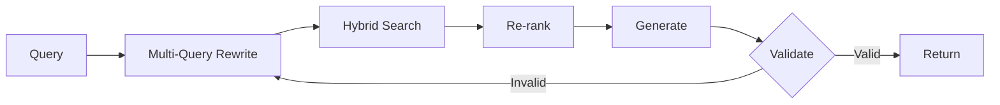

# 🤖 Celeby Agentic RAG

**Production-ready self-correcting RAG system with LangGraph orchestration, hybrid search, and intelligent re-ranking**

[](https://www.python.org/downloads/)
[](https://fastapi.tiangolo.com/)
[](https://react.dev/)
[](https://www.docker.com/)
[](LICENSE)

---

## 🎯 What Makes This Special?

Unlike traditional RAG systems, **Celeby Agentic RAG is an autonomous agent** that validates and self-corrects its responses:



**Key Innovation**: Self-correction loop with validation gates achieves **11.1% automatic answer improvement** without human intervention.

### Why Celeby Agentic RAG?

| Problem | Traditional RAG | Celeby Agentic RAG |
|---------|----------------|-------------------|
| **Hallucinations** | No validation | ✅ Validates every answer, retries if unsupported |
| **Poor Retrieval** | Single strategy | ✅ Hybrid search + query rewriting |
| **No Quality Metrics** | Blind to accuracy | ✅ Built-in RAGAS evaluation |
| **Slow Responses** | No optimization | ✅ Redis caching + streaming |

---

## 🚀 Quick Start

### Prerequisites

- **Docker & Docker Compose** (20.10+)
- **8GB+ RAM** (16GB optimal)
- **~10GB disk space** for models
- **NVIDIA GPU** (optional, for faster inference)

### Installation

#### 1. Clone Repository

```bash
git clone https://github.com/merenceleby/Celeby-Agentic-RAG.git
cd Celeby-Agentic-RAG
```

#### 2. Start Services (Choose Your Hardware)

**CPU-only:**
```bash
docker-compose --profile cpu up -d
```

**NVIDIA GPU (Tested on RTX series):**
```bash
# Verify GPU access first
docker run --rm --gpus all nvidia/cuda:11.8.0-base-ubuntu22.04 nvidia-smi

# Start services
docker-compose --profile nvidia up -d
```

**AMD GPU:**
```bash
# Verify ROCm
docker run --rm --device=/dev/kfd --device=/dev/dri rocm/pytorch:latest rocm-smi

# Start services
docker-compose --profile amd up -d
```

**Apple Silicon (M1/M2/M3):**
```bash
docker-compose --profile mac up -d
```

#### 3. Pull Language Model

```bash
# Wait for Ollama to start (check: docker logs ollama)
docker exec -it ollama ollama pull phi3:mini

# Verify
docker exec -it ollama ollama list
```

#### 4. Add Documents

```bash
# Copy PDFs to documents folder
cp /path/to/your/*.pdf backend/data/documents/

# Or use web UI to upload
```

#### 5. Initialize Vector Database

- Open browser: `http://localhost:5173`
- Navigate to **Admin Panel**
- Click **"🔄 Initialize DB"**
- Wait for indexing

#### 6. Start Querying!

**5 minutes from clone to first query.**

---

## 🏗️ Architecture

```
┌─────────────┐
│   User      │
│  Interface  │
└──────┬──────┘
       │
       ▼
┌─────────────────────────────────────────┐
│         FastAPI Backend                 │
│  ┌────────────────────────────────┐    │
│  │     LangGraph RAG Agent        │    │
│  │  ┌──────────────────────────┐  │    │
│  │  │  1. Query Analysis       │  │    │
│  │  │  2. Query Rewriting (3x) │  │    │
│  │  │  3. Hybrid Retrieval     │  │    │
│  │  │     - Vector Search      │  │    │
│  │  │     - BM25 Search        │  │    │
│  │  │  4. RRF Fusion           │  │    │
│  │  │  5. Cross-Encoder Rerank │  │    │
│  │  │  6. LLM Generation       │  │    │
│  │  │  7. Answer Validation    │  │    │
│  │  │  8. Self-Correction ↻    │  │    │
│  │  └──────────────────────────┘  │    │
│  └────────────────────────────────┘    │
│                                         │
│  ┌─────────┐  ┌─────────┐  ┌────────┐ │
│  │ ChromaDB│  │  Redis  │  │ SQLite │ │
│  └─────────┘  └─────────┘  └────────┘ │
└─────────────────────────────────────────┘
```

### Technical Stack

**Backend (All Local)**:
- **LLM**: Phi-3 Mini (3.8B) via Ollama
- **Framework**: LangGraph for agent orchestration
- **Vector DB**: ChromaDB with persistent storage
- **Embeddings**: sentence-transformers/all-MiniLM-L6-v2 (offline)
- **Re-ranker**: cross-encoder/ms-marco-MiniLM-L-6-v2 (offline)
- **Keyword Search**: BM25 with Reciprocal Rank Fusion
- **Cache**: Redis (local, in-memory)
- **API**: FastAPI with async/await

**Frontend (Local Web App)**:
- React 18 + Vite
- Modern CSS with gradient design
- Axios with streaming support

**Infrastructure**:
- Docker Compose with GPU support
- SQLite for metrics/history/feedback (local)
- Localhost only - no external connections

---

## 🌟 Features

### Core Capabilities

| Feature | Description |
|---------|-------------|
| **🔄 Self-Correction** | LangGraph validation + automatic retry |
| **📝 Query Rewriting** | 3x query variations for comprehensive retrieval |
| **🔍 Hybrid Search** | Vector + BM25 with RRF fusion |
| **🎯 Cross-Encoder Re-ranking** | State-of-the-art precision |
| **⚡ Streaming Responses** | Real-time ChatGPT-style generation |
| **📊 RAGAS Evaluation** | Faithfulness, relevancy, recall metrics |
| **💾 Redis Caching** | Sub-second repeat queries |
| **🗂️ Chat History** | Persistent SQLite storage |

### 🔒 Privacy-First & Offline

**100% Local Operation**:
- ✅ Your data never leaves your machine
- ✅ No external API calls (after model download)
- ✅ GDPR/HIPAA friendly
- ✅ Zero recurring costs

**Perfect For**:
- 🏥 Healthcare: HIPAA-compliant patient data
- ⚖️ Legal: Confidential case documents
- 🔬 Research: Proprietary papers
- 🏢 Enterprise: Internal knowledge bases

---

## 📊 System Performance

| Metric | Value | Impact |
|--------|-------|--------|
| **Self-Correction Rate** | 11.1% | Automatic quality improvement |
| **Cache Hit Rate** | 26.7% | Sub-second repeat queries |
| **P95 Latency** | 29.4s (Quality mode) | Accuracy over speed |
| **Faithfulness** | 50-83% | Answer grounding verified |
| **Error Rate** | 0.0% | Production-stable |

*(Based on 45 queries across Harry Potter corpus)*

---

## 📸 Screenshots

### Main Chat Interface


*Response modes, chat history, document panel, streaming answers*

### Performance Metrics


*Real-time monitoring: latency, corrections, cache hits*

### RAGAS Evaluation


*Automated quality: faithfulness 50%, relevancy 83%, recall 50%*

### 👥 User Feedback System


*Built-in feedback loop enables you to track answer quality from the user's perspective and identify areas for improvement.*


---

## 🎮 Response Modes

### 🎯 Quality Mode (Self-Correcting) - **Recommended**

1. Multi-query rewriting (3x variations)
2. Hybrid retrieval (vector + BM25)
3. RRF fusion
4. Cross-encoder re-ranking
5. LLM generation
6. Answer validation
7. Self-correction if invalid (up to 2 retries)

**Latency**: ~10.8s | **Best for**: Critical queries

### ⚡ Fast Mode (Streaming)

1. Single query (no rewriting)
2. Vector search only
3. No re-ranking
4. Token-by-token streaming

**Latency**: ~1.2s first token | **Best for**: Exploratory Q&A

### 💬 Direct LLM (No Documents)

Pure LLM response without retrieval.

**Latency**: ~0.5s | **Best for**: General knowledge

---


## ⚠️ Known Limitations

**Hallucinations**: Like all local LLMs (Phi-3 Mini, 3.8B params), occasional hallucinations may occur.

**Mitigation strategies**:
- Self-validation catches 11.1% of issues automatically
- Source attribution enables manual verification
- RAGAS faithfulness metric tracks answer quality
- Upgrade to larger models.

**Recommendation**: Always verify critical answers against sources.


## 🔬 Technical Deep Dive

### Self-Correction Mechanism

```python
def validate_answer(state: AgentState) -> dict:
    """LangGraph node: validates answer against context"""
    answer = state["answer"]
    context = state["context"]
    
    is_valid = llm_validator(answer, context)
    
    if not is_valid and state["correction_attempts"] < MAX_ATTEMPTS:
        return {"needs_correction": True, "correction_attempts": +1}
    
    return {"needs_correction": False}
```

### Hybrid Search Pipeline

```python
def hybrid_search(query: str) -> List[Document]:
    # 1. Multi-query rewriting
    queries = rewrite_query(query, n=3)
    
    # 2. Parallel retrieval
    vector_results = chromadb.search(queries, n=20)  # Semantic
    bm25_results = bm25.search(queries, n=10)        # Keyword
    
    # 3. Reciprocal Rank Fusion
    fused = rrf_fusion(vector_results, bm25_results)
    
    # 4. Cross-encoder re-ranking
    reranked = reranker.rerank(query, fused, top_k=5)
    
    return reranked
```

---

## 🛠️ Configuration

**Key Parameters** (`backend/config.py`):

```python
# Model Configuration
OLLAMA_MODEL = "phi3:mini"
EMBEDDING_MODEL = "all-MiniLM-L6-v2"
RERANKER_MODEL = "cross-encoder/ms-marco-MiniLM-L-6-v2"

# RAG Parameters
CHUNK_SIZE = 512
CHUNK_OVERLAP = 50
TOP_K_RETRIEVAL = 20
TOP_K_RERANK = 5
TOP_K_BM25 = 10

# Agent Parameters
MAX_CORRECTION_ATTEMPTS = 2
NUM_QUERY_VARIATIONS = 3
TEMPERATURE = 0.7

# Cache
CACHE_TTL = 3600
ENABLE_CACHE = True
```

---

## 📊 API Examples

### Query with Self-Correction

```bash
curl -X POST http://localhost:8000/api/query \
  -H "Content-Type: application/json" \
  -d '{
    "query": "Who is Voldemort?",
    "mode": "quality",
    "max_sentences": 6
  }'
```

**Response:**
```json
{
  "answer": "Voldemort, also known as Lord Voldemort...",
  "sources": [
    {
      "content": "...",
      "metadata": {"source": "harry_potter.pdf", "page": 1},
      "relevance_score": 0.95
    }
  ],
  "metadata": {
    "query_time": 10.8,
    "num_sources": 5,
    "correction_applied": false
  }
}
```

### Streaming Response

```bash
curl -X POST http://localhost:8000/api/query-stream \
  -d '{"query": "Explain Horcruxes"}' \
  --no-buffer
```

### Upload Document

```bash
curl -X POST http://localhost:8000/api/upload \
  -F "file=@document.pdf"
```

### Get Metrics

```bash
curl http://localhost:8000/api/metrics
```

**Interactive Docs**: `http://localhost:8000/docs`

---


## 🧪 Evaluation
### Run Evaluation (auto-generates test questions from your documents)
```bash
curl -X POST "http://localhost:8000/api/evaluation/run?n_questions=50"
```
**Metrics**:
- **Faithfulness**: Answer accuracy vs context (target >80%)
- **Relevancy**: How well answer addresses question (target >80%)
- **Recall**: Retrieval quality (target >80%)

### Improving Low Scores

**Low Faithfulness (<70%)**:
- Increase `TOP_K_RETRIEVAL`
- Adjust `CHUNK_SIZE`
- Review prompt engineering

**Low Relevancy (<70%)**:
- Lower `TEMPERATURE`
- Improve query rewriting

**Low Recall (<70%)**:
- Add more documents
- Increase `TOP_K_BM25`

---

## 📁 Project Structure

```
celeby-agentic-rag/
├── 📄 docker-compose.yml        # Multi-service orchestration
├── 📄 LICENSE                   # Apache 2.0
├── 📄 README.md                
│
├── 📂 backend/
│   ├── 📄 Dockerfile
│   ├── 📄 requirements.txt
│   ├── 📄 config.py             # Centralized configuration
│   ├── 📄 main.py               # FastAPI application entry
│   │
│   ├── 📂 api/
│   │   ├── 📄 __init__.py
│   │   └── 📄 routes.py         # API endpoint definitions
│   │
│   ├── 📂 services/
│   │   ├── 📄 __init__.py
│   │   ├── 📄 agent.py          # ⭐ LangGraph RAG agent
│   │   ├── 📄 llm.py            # Ollama LLM integration
│   │   ├── 📄 embedding.py      # Document embeddings
│   │   ├── 📄 vector_store.py   # ChromaDB + persistence
│   │   ├── 📄 bm25_search.py    # BM25 keyword search
│   │   ├── 📄 reranker.py       # Cross-encoder re-ranking
│   │   ├── 📄 query_analyzer.py # Query understanding
│   │   ├── 📄 cache.py          # Redis caching layer
│   │   ├── 📄 metrics.py        # Performance tracking
│   │   ├── 📄 chat_history.py   # Conversation persistence
│   │   └── 📄 feedback.py       # User feedback storage
│   │
│   ├── 📂 evaluation/
│   │   └── 📄 ragas_eval.py     # RAGAS evaluation engine
│   │
│   ├── 📂 models/
│   │   └── 📄 __init__.py       # Pydantic models
│   │
│   ├── 📂 data/
│   │   └── 📂 documents/        # Upload PDFs here
│   │
│   ├── 📂 chroma_db/            # Persistent vector database
│   │
│   └── 📊 Database Files
│       ├── chat_history.db      # Conversation logs
│       ├── feedback.db          # User ratings
│       └── metrics.db           # Performance data
│
├── 📂 frontend/
   ├── 📄 Dockerfile
   ├── 📄 package.json
   ├── 📄 vite.config.js
   ├── 📄 index.html
   │
   └── 📂 src/
       ├── 📄 App.jsx           # Main app component
       ├── 📄 App.css
       ├── 📄 main.jsx
       ├── 📄 index.css
       │
       └── 📂 components/
           ├── 📄 ChatInterface.jsx       # Main chat UI
           ├── 📄 ChatSidebar.jsx         # Chat history
           ├── 📄 DocumentsList.jsx       # Document manager
           ├── 📄 AdminPanel.jsx          # Metrics dashboard
           ├── 📄 MetricsDashboard.jsx    # Performance charts
           └── 📄 (corresponding .css files)


    
```

---

## 🐛 Troubleshooting

### Ollama Not Responding

```bash
docker logs ollama
docker restart ollama
docker exec -it ollama ollama list
```

### GPU Not Detected

**NVIDIA:**
```bash
nvidia-smi
docker run --rm --gpus all nvidia/cuda:11.8.0-base-ubuntu22.04 nvidia-smi
```

**AMD:**
```bash
rocm-smi
docker run --rm --device=/dev/kfd --device=/dev/dri rocm/pytorch:latest rocm-smi
```

### ChromaDB Errors

```bash
docker-compose down -v
rm -rf backend/chroma_db/*
docker-compose up -d
```

### Slow Responses

```python
# config.py
ENABLE_CACHE = True
TOP_K_RETRIEVAL = 10  # Reduce from 20
TOP_K_RERANK = 3      # Reduce from 5
```

Or use Fast mode in UI.

---


## 📄 License

Apache License 2.0 - see [LICENSE](LICENSE)

---

## 🙏 Acknowledgments

LangChain • LangGraph • Ollama • ChromaDB • RAGAS • Sentence Transformers • FastAPI • React

---

## 📧 Contact

**Muhammed Eren Çelebi**

- GitHub: [@merenceleby](https://github.com/merenceleby)
- LinkedIn: [linkedin.com/in/merencelebi](https://linkedin.com/in/merencelebi)
- Email: muhammederencelebii@gmail.com

---

<div align="center">

**⭐ Star this repository if you find it useful!**

Made by Celeby

</div>
